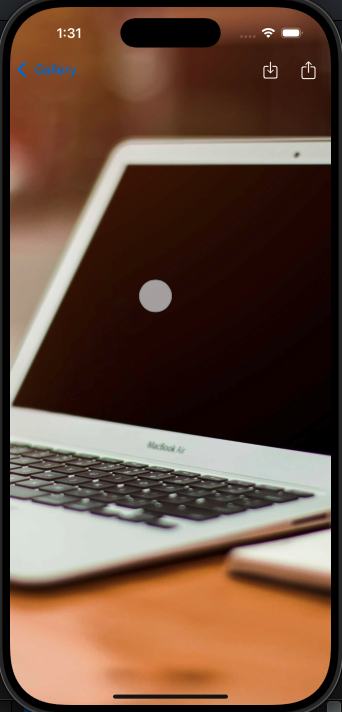

# SwiftUI Photo Gallery App

A simple iOS application built with **SwiftUI** that displays a collection of photos in a list or grid. Users can tap on a photo to view it in full-screen mode with pinch-to-zoom functionality. The app uses **URLSession** for network calls and **Combine** for reactive programming.

---

## Features

### Core Features
- Display a list or grid of photos fetched from the [Picsum API](https://picsum.photos/).
- Full-screen photo view with **pinch-to-zoom** and drag-to-move functionality.
- Double-tap to reset zoom and position.
- Fetch photos asynchronously using **URLSession** and **Combine**.
- Smooth scrolling with no crashes or freezes.
- Save photos to the device’s gallery in **JPEG format**.
- Share photos via **UIActivityViewController**.

### Optional / Completed Enhancements
- **Unit tests** covering key functionalities of `HomeViewModel`.  
- **Image caching** to reduce repeated network calls.  
- **API response caching** using `URLCache`.  
---

## Architecture

- **SwiftUI**: Declarative UI for both grid and full-screen views.  
- **MVVM Pattern**:
  - `HomeViewModel`: Manages fetching, pagination, and caching of photos.  
  - `FullScreenPhotoViewModel`: Handles saving and sharing photos, zoom state.  
- **Services**:
  - `NetworkService`: Handles API calls.  
  - `ImageCacheService`: Manages caching of loaded images.  
  - `PhotoSaverService`: Saves images to the device gallery.  
- **Combine**: Handles asynchronous data flow and state updates.  
- **Unit Tests**:
  - Mock services (`MockNetworkService`, `MockImageCacheService`) for isolated testing.  
  - `HomeViewModelTests` verifies photo loading, error handling, pagination, and image caching.  

---

### Screenshots

**Grid View**  


**Full-Screen View**  


**Save and Share Sheet**  


**Zoomed Image**


---

## Installation

1. Clone the repository:  
```bash
git clone https://github.com/Akram-Ul-Hasan/PhotoGallery.git
