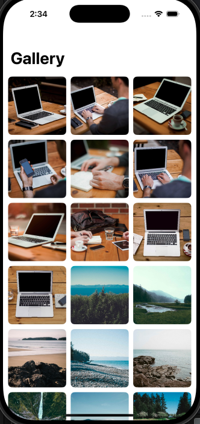
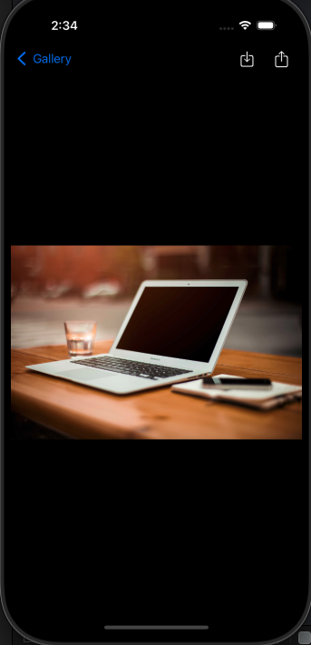
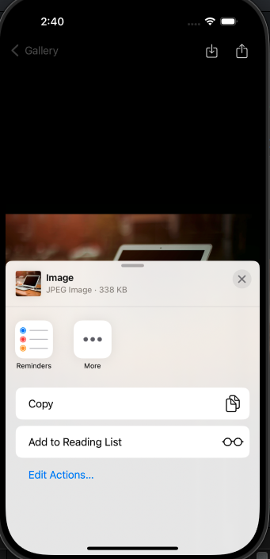

# SwiftUI Photo Gallery App

A simple iOS application built with **SwiftUI** that displays a collection of photos in a list or grid. Users can tap on a photo to view it in full-screen mode with pinch-to-zoom functionality. The app uses **URLSession** for network calls and **Combine** for reactive programming.

---

## Features

### Core Features
- Display a list or grid of photos fetched from the [Picsum API](https://picsum.photos/).
- Full-screen photo view with **pinch-to-zoom** and drag-to-move functionality.
- Double-tap to reset zoom and position.
- Fetch photos asynchronously using **URLSession** and **Combine**.
- Smooth scrolling with no crashes or freezes.
- Save photos to the device’s gallery in **JPEG format**.
- Share photos via **UIActivityViewController**.

### Optional/Planned Enhancements
- Unit tests (not implemented yet)
- Image caching (not implemented yet)
- API response caching (not implemented yet)

---

## Architecture

- **SwiftUI**: Declarative UI for both grid and full-screen views.
- **Combine**: Handles network requests and state updates.
- **MVVM Pattern**:
  - `HomeViewModel`: Manages photo fetching and state.
  - `FullScreenPhotoViewModel`: Handles photo saving and messages.
- `PhotoSaverService`: Responsible for saving images to the photo library.

---

## Screenshots


- **Grid View**

```markdown




